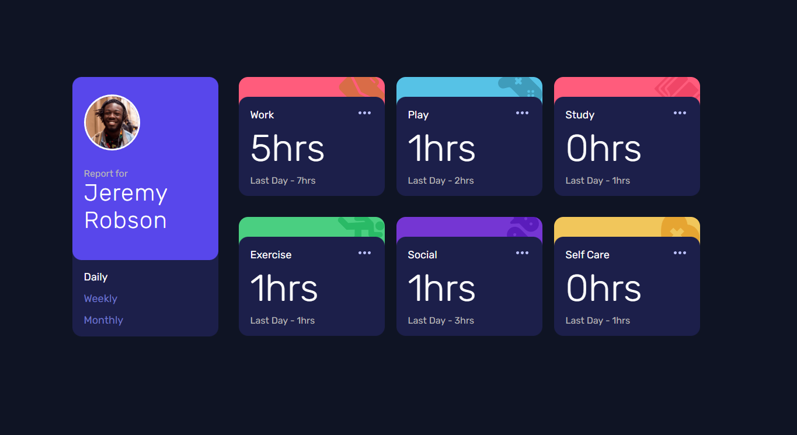

# Frontend Mentor - Time tracking dashboard solution

This is a solution to the [Time tracking dashboard challenge on Frontend Mentor](https://www.frontendmentor.io/challenges/time-tracking-dashboard-UIQ7167Jw). Frontend Mentor challenges help you improve your coding skills by building realistic projects. 

## Table of contents

- [Overview](#overview)
  - [The challenge](#the-challenge)
  - [Screenshot](#screenshot)
  - [Links](#links)
- [My process](#my-process)
  - [Built with](#built-with)
  - [What I learned](#what-i-learned)
  - [Continued development](#continued-development)
- [How to run the project?](#how-to-run-the-project)
- [Author](#author)

## Overview

### The challenge

Users should be able to:

- View the optimal layout for the site depending on their device's screen size
- See hover states for all interactive elements on the page
- Switch between viewing Daily, Weekly, and Monthly stats

### Screenshot





### Links

- Solution URL: [Github Repository](https://github.com/gustavomarim/time-tracking-dashboard)
- Live Site URL: [Github Pages](https://gustavomarim.github.io/time-tracking-dashboard/)

## My process

### Built with

- Semantic HTML5 markup
- CSS custom properties
- CSS Flexbox
- CSS Grid
- Mobile-first workflow
- JavaScript

### What I learned

In this project I was able to implement all the techniques and concepts learned along my trajectory of studies with programming, through college and complementary courses focused on web development.

I could understand the use of HTML semantic markup in a clean way, the organized styling with CSS FlexBox and Grid Layout, and finally, the manipulation of the DOM with JavaScript, using events and consuming an API.

### Continued development

I will continue to focus and deepen my studies in the JavaScript programming language, seeking fluency in the technology in order to facilitate problem solving and improve writing clean code.

### How to run the project?

Feel free to test the project and make any changes you like.

Below I will leave the step by step on how to install and make the application work!

Let's code!!

#### Prerequisites
>Before starting, you will need to have the following tools installed on your machine: [Git](https://git-scm.com), [Node.js](https://nodejs.org/en/) and [Live Server](https://marketplace.visualstudio.com/items?itemName=ritwickdey.LiveServer).
>Also, it's nice to have an editor to work with code like [VsCode](https://code.visualstudio.com).

#### Running on localhost

```
# Clone this repository:
$ git clone https://github.com/gustavomarim/time-tracking-dashboard

# Go to project folder in terminal/cmd:
$ cd time-tracking-dasboard

# Run the application on an HTTP Live Server
# In the file 'index.html' run the command:
$ Alt + L Alt + O 

# The server will start at localhost on the default port
```

## Author
<a href="https://github.com/gustavomarim">
 
 <br />
 <sub><b>Gustavo Dantas</b></sub></a> <a href="https://github.com/gustavomarim" title="GitHub">🚀</a>

Feito com ❤️ por Gustavo Dantas 👋🏽

- LinkedIn - [Gustavo Dantas](https://www.linkedin.com/in/gustavodantasmarim/)
- Frontend Mentor - [@gustavomarim](https://www.frontendmentor.io/profile/gustavomarim)
- Github - [Gustavo Dantas](https://github.com/gustavomarim)
